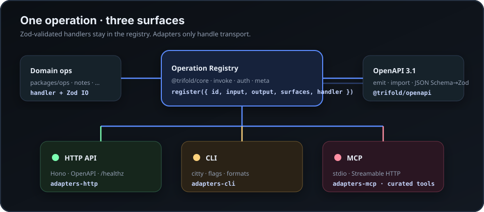

# Demo walkthrough

A short tour of the included samples. For the full story, start at the [README](../README.md).

## 0. Prerequisites

```bash
pnpm install
pnpm validate   # typecheck + test + secret scan
```

## 1. Tasks sample — API + CLI (shared store)

```bash
export APP_API_KEY=dev-key
export TASKS_STORE_PATH=.data/demo-tasks.json

# terminal A
pnpm dev:api
# http://localhost:8787/openapi.json

# terminal B
pnpm --filter @app/cli start -- tasks create "Ship demo" --json
pnpm --filter @app/cli start -- tasks list --json
```

`tasks.complete` is available on HTTP/CLI but **not** registered as an MCP tool — intentional curation.

## 2. MCP for agents

```bash
export APP_API_KEY=dev-key
pnpm dev:mcp          # stdio
# or
pnpm dev:mcp:http     # http://127.0.0.1:8790/mcp  (+ /healthz)
```

Curated tools from the tasks sample: `tasks_list`, `tasks_get`, `tasks_create`.

## 3. Scaffold a product

```bash
pnpm scaffold -- inventory --dry-run
# pnpm scaffold -- inventory
# pnpm install && pnpm --filter @cli-mcp/inventory test
```

The repo already includes **notes** as a scaffolded product:

```bash
export APP_API_KEY=dev-key
export NOTES_STORE_PATH=.data/demo-notes.json
pnpm --filter @app/notes-cli start -- notes create "Hello" --json
pnpm --filter @app/notes-cli start -- notes list --json
```

## 4. OpenAPI import

```bash
pnpm openapi:import -- examples/tasks/openapi.snapshot.json
pnpm openapi:import -- examples/tasks/openapi.snapshot.json --skeleton | head -40
```

Imported stubs get HTTP/CLI surfaces and Zod inputs derived from JSON Schema. Handlers start as `NOT_IMPLEMENTED` until you implement them.

## 5. Architecture

See [ARCHITECTURE.md](./ARCHITECTURE.md) and the hero diagram:


